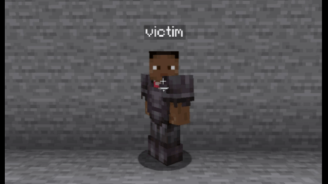

# Damager ENW

**Damager ENW** is a Minecraft plugin that enhances the damage and kill displays with customizable animations and messages.

## Features

- **Damage Display:** Shows damage dealt to entities with customizable text and animations.
- **Kill Display:** Shows special messages for kills with sequential or random messages.
- **Custom Animations:** Supports increase, decrease, and upward animations.
- **Configurable Display:** Control scale, opacity, duration, and more.

## Permissions
- `damagerenw.see` - Allows players to see damage displays and kill messages.

admin:
- `damagerenw.use` - Allows players to use the plugin commands.
- `damagerenw.reload` - Allows players to reload the plugin configuration.

## Download
You can download the plugin from:
- [GitHub releases](https://github.com/enwulf/Damager-ENW/releases)
- [Modrinth](https://modrinth.com/plugin/damager-enw)
- [SpigotMC](https://www.spigotmc.org/resources/damager-enw.117162/)
